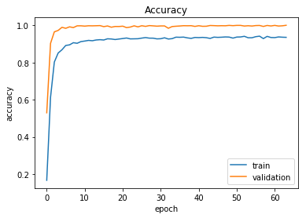

# Machine Learning Engineer Nanodegree
## Capstone Project
* Sitansh Rajput
* April 15th, 2019

## I. Definition

### Project Overview

Using a dataset on Kaggle provided by `tecperson`, this project attempts to detect letters formed by a hand (using ASL) on a 28x28 grayscale image. Each pixel has a value between 0-255. 0 is pure white, and 255 is pure black. Using a Convolutional Neural Network, the model will train on the ~20,000 images provided by the training set, and try to get an accuracy of over 95% on the testing set. An explanation of accuracy as a good, and relevant scoring algorithm for this problem set will be provided later down in this report. 

### Problem Statement

The problem we are attempting to solve is to classify a 28x28 image and approriately assign it to the right label (letter). 

We will do this by first examining the data we have, and to look for errors in the data, such as missing features, and imbalanced class representation in the training and testing sets. We will then pre-process the data to make it even and full-featured. From there, we will look to the necessity of augmenting the data to make a more robust model. A very typical issue with unaugmented data with neural networks is their tendency to overfit. This means that the models tend to memorize the data instead of making robust analysis of their features and patterns. 

### Metrics

Accuracy is generally an extremely efficent and easy to calculate score that is a good indicator of performance. However, it can be prone to error and easy to skew, so we must make sure the data is even across classes in training and testing. However, as will be shown later in the report, the data used for both training and testing are relatively balanced across the classes, so the metric to measure performance for the model will be accuracy. 

## II. Analysis

### Data Exploration

Stated earlier, the dataset is provided through Kaggle. The dataset contains two files, a train.csv and test.csv. For each .csv, a row represents a 28\*28 grayscale image and contains 785 columns, one for the label, and 784 for each pixel of the 28\*28 image with a value between 0-255. 

After pre-processing the data, there seems to be no missing values or outliers to take care of. The classes (A, B, C, ..., Z) are relatively even in their makeup of the data, so we do not need to cull the data, nor focus on any specific class.

### Exploratory Visualization

As we can see, the labels/classes are consistent and even within the data.

This is how one of the images would look to the naked eye. 

This is an image after it has been altered for its brightness, zoom, and rotation.

### Algorithms and Techniques

The model will be a CNN, using a mixture of Conv2D, AveragePooling2D, Dropout, and Dense layers. The loss function will be Categorical Crossentropy while the optimizer will be using the Nadam algorithm. 

We use a Conv2D because the image is only a 2 dimensional image, there also exists different separable convutional layers on Keras, however, there main advantage is in lower processing times due to less computation but they offer no real accuracy advantage and we are not starved for power in this model. Moreover, the depthwise separable layer would not help as this image only has a depth of 1 as it's only grayscale and not RGB.

The pooling layer is used because we need a way to find important local features and reduce variance in the data. There also existed GlobalMaxPooling and AveragePooling, however, it doesn't extract edges as well (since it creates an average of the neighborhood) and GlobalMaxPooling doesn't care about the neighborhood at all and would not be relevant for this model and problem. 

We use Dropout to help prevent overfitting. The biggest problem the benchmark model ran into (as will be shown later) was that it very heavily overfitted the data, achieving 99%+ during fitting, but only 85% when ran against the test set. 

The Dense layer is used as the last layer of the model so that it can take the input and output the highest scoring label for the image. 

We use Categorical Crossentropy as our loss function as it is best suited towards multiclass, single-label classification problems. Which is exactly what this problem is.

Finally, we use Adam as our optimizer because of it's generally high performance across a wide array of problems. 

### Benchmark

The benchmark will be a publically available kernel on Kaggle. It creates a relatively simple 3 layer CNN that achieves an accuracy of 85%. Looking at the history of the model during it's training phase, we see that it very quickly reaches an accuracy of 99%+ in both its training and validation data which is classic sign of overfitting. This means that the model did not truly learn the features of the data, and is instead relying on memorizing patterns, as evidenced by the 85% on the testing data. 

* https://www.kaggle.com/ranjeetjain3/deep-learning-using-sign-langugage

## III. Methodology

### Data Preprocessing

There was no need to pre-process the data to clean it out as there were no outliers, missing features and all classes were evenly distributed through the data. However, in order to make the model more robust and less prone to overfitting the data, I used an ImageGenerator that would alter the brightness, rotate, skew, and shift the images. This generator is used during the fitting process, and provides live alterations to the images.

### Implementation

This is the model for the neural network, it follows the algorithms described earlier exactly.
One thing not shown in the diagram, but was crucial for the proper performance of the model was the implementation of PlaidML as the backend to Keras. This was done because Keras by default uses Tensorflow as it's backend, however, Tensorflow does not support AMD-based GPU acceleration, instead using CUDA computations to accelerate training which can only be done on Nvidia cards. 

There was a report that systemically ran through many different algorithms, kernel sizes, activation layers, batch sizes and network widths and compared their resulting accuracies. I used this paper as the basis of most of my decisions in this implementation. 

https://arxiv.org/pdf/1606.02228.pdf

### Refinement

A lot of refinement was done to achieve a consistent accuracy of >99%. A lot of fitting was done using a wide array of filters, kernel sizes, padding, and dropout rates, they were initially based off of the paper, but adjustments were made per the results of the training process. 

## IV. Results

### Model Evaluation and Validation

The model is definitely aligning with the expectations for the solution. I did not go beyond testing the model with the original altered images, but there is no reason to not assume that the model would not work just as well with similar images but of differnt sign languages seeing as it is able to not overfit on specific patterns. 

Since I used an ImageDataGenerator, changes to the training data or input space do not affect the results to a major effect, if at all. 

### Justification

We ended with a model that is significantly stronger than the benchmark provided earlier. As stated earlier, this is because the model is not overfitting the training data anymore. The image alteration by the ImageDataGenerator and the addition of the dropout layers make sure that the model is not memorizing features but is generalzing the patterns that are necessary to know for a proper model.

## V. Conclusion

### Free-Form Visualization

One of the more interesting things about this model is it's tendency to die in the middle, this is consisitent between runs and seems to be affected by the Dropout rate, but only slightly. There is always a significant drop regardless of the dropout rate, however the amount and which epoch it occurs in, changes. 

As a note, the previous model's last two layers consisted of two consecutive Dense layers. While I was writing this report, I removed the second-to-last Dense layer in my model, as I didn't think it was adding any value. Since then, my model is achieving the same general accuracy, while not dying during the middle of fitting.

### Reflection

One of the more difficult parts of the project was researching all the existing activation, optimizer, and loss functions that exist for CNNs. While Keras gave brief introductions to them in their documentation, it was hard to truly understand each of their unique benefits from the documentation. This lead to a lot of reading of research papers and articles. 

Overall though, I'm very happy with the outcome of the model. I have not tested for the robustness of the model, though I am confident that it would be able to label images from different sign languages. 

### Improvement

Although the accuracy of the model was between 97%-99% between runs, there is still some room for improvement. The robustness of the model could be improved by using pre-trained models like VGG16 or Resnet. The robustness could allow for additional languages, and images of different resolutions and clarity. There is still the possibility of achieving a model that attains a consistent accuracy of >99%. 

Right now the model achieves an accuracy ~93% on the training data near the end of the fitting process, while the validation accuracy hoves ~100%. This is indicative that the model could be trained, and fitted better to the data by changing its model. I would also assume that a more epochs, or a lower batch size would help this, at a significant cost of training time. 
